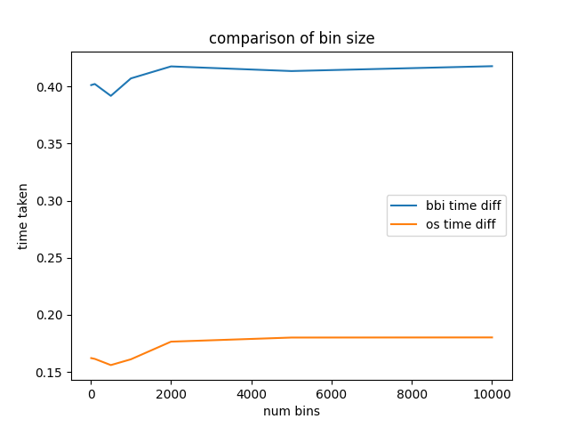

# Compare BBI
A comparison between pyBBI and bigWigSummary

## Results
Results from the tests

## Setup
1. `git clone https://github.com/deltarod/compareBBI.git`
2. `cd compareBBI`
3. `wget http://hgdownload.soe.ucsc.edu/admin/exe/linux.x86_64.v385/bigWigSummary`
4. `sudo chmod a+x bigWigSummary`
5. `python3 -m pip install pybbi`
6. `python3 run.py`